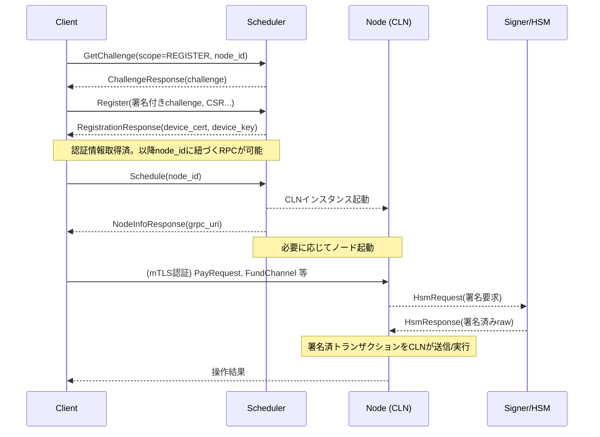
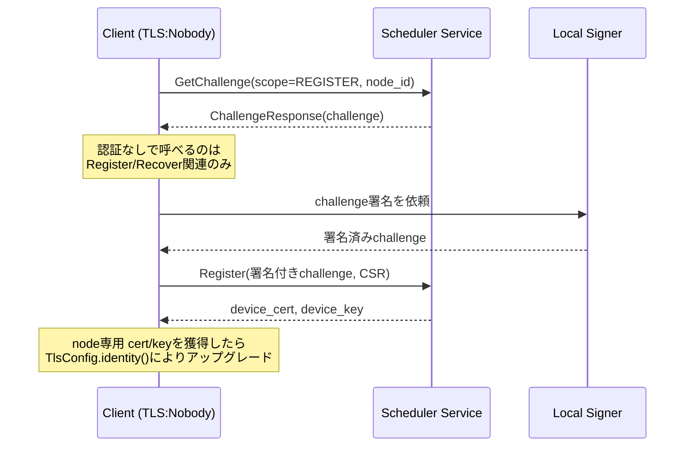
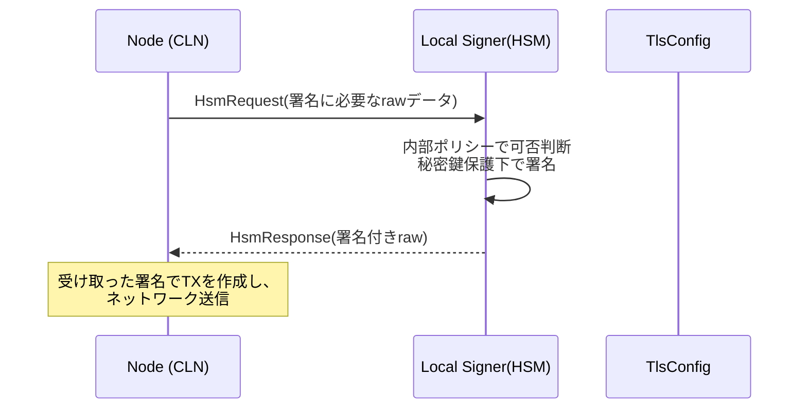
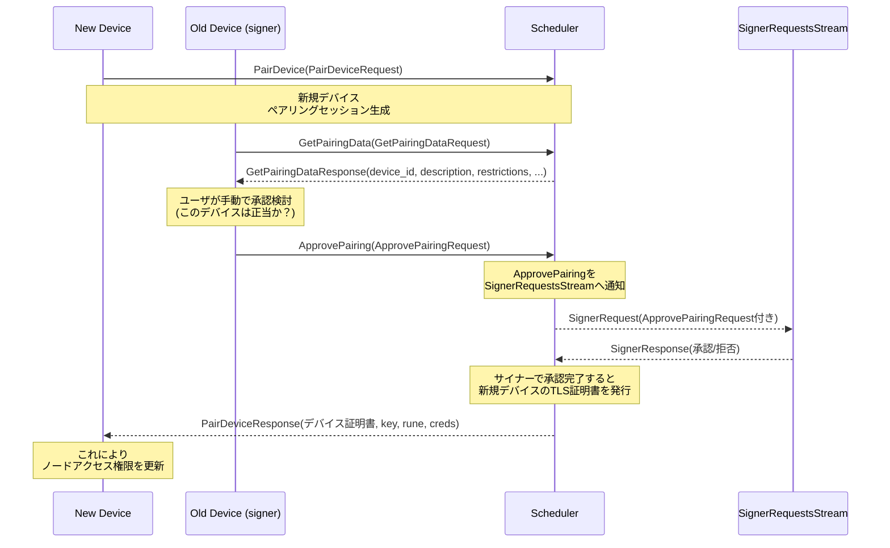

[greenlight proto](https://github.com/Blockstream/greenlight/tree/adac70212c70119cc7e7174a742133e14dcdea0a/libs/proto/glclient) をベースに、gpt o1に解説させたものに修正を加えています。

## 1. 概要

Scheduler (scheduler.proto) と Signer 機構 (greenlight.proto の Node サービス領域内に含まれる HSM 連携など) を中心に、ノード管理フローおよび署名リクエストが c-lightning (CLN) に到達するまでのシーケンスを示します。  
本稿末尾に Pairing (ペアリング) 機能の proto 定義と詳細シーケンスも加えて解説します。

Scheduler は、Greenlight 上でノードをホストし管理するためのエンドポイントを提供するサービスです。  
一方、Node (greenlight.proto) はノードへのインタラクション (ログ取得・支払い・HSM リクエスト等) を定義し、Signer 連携 (HsmRequest / RespondHsmRequest) を介して秘密鍵操作や承認を行います。

ノードは基本的に c-lightning (CLN) インスタンスで構成され、Scheduler と Signer の組み合わせで外部アクセス(API)をコントロールします。

---

## 2. ノード登録とスケジューリングフロー

### 2-1. チャレンジ発行 (GetChallenge)
- scope (REGISTER or RECOVER) と node_id を渡し、サーバ側で challenge (署名対象) を生成  
- ChallengeResponse には一度きり有効な challenge が含まれ、後続の Register / Recover で署名送信に用いる  

### 2-2. Register / Recover
- クライアントは challenge を秘密鍵で署名し、node_id, network, CSR などを付与して送信  
- サーバは署名検証によってノード所有権を確認し、mTLS 証明書 (device_cert, device_key) を発行  
- Register 時は初回発行、Recover 時は既存ノードの証明書再発行  
- この証明書と秘密鍵で以降の操作を認証 (node_id ごとに厳密にアクセスを制限)

### 2-3. Schedule / GetNodeInfo
- Schedule でノード起動を要求すると、Greenlight インフラ上に c-lightning (CLN) が割り当てられ、grpc_uri 等の接続情報が返る  
- 既に起動済みであれば GetNodeInfo から接続情報を取得可能 (wait=true で割り当て完了を待機するシナリオも)

### 2-4. 接続・操作
- mTLS 認証情報 (device_cert, device_key) により、node.proto や greenlight.proto 内の RPC (支払い・チャンネル操作等) にアクセスできる  
- 署名が必要な操作 (例: チャネルオープン時のトランザクション署名など) は SignerEngine (HSMRequest) を通じて行われる  

---

## 3. Signer フロー (HSMRequest / HsmService)

`greenlight.proto` に定義される Node サービスには、HSM 関連の RPC が含まれています。これにより以下のようなシナリオで署名リクエストがやり取りされます。

1. ノード (CLN) 側が秘密鍵操作を要求:  
   - StreamHsmRequests によって、CLN が必要とするトランザクション署名等のリクエスト (HsmRequest) が送信される  
2. Signer が応答生成:  
   - 別途動作するサイナー (たとえばローカルデバイスの鍵管理アプリ) が HsmRequest を受け取り、秘密鍵で署名や承認を行う  
3. Node へ署名結果を返却:  
   - HsmResponse に署名済みデータ (raw) を埋め、RespondHsmRequest などから戻す  
4. CLN は署名付きトランザクション等を引き取り、実際の処理を進める  

`greenlight.proto` 内の主な要素:  
- HsmRequest  
  - request_id: マッチング用識別子  
  - raw: 実際に署名対象として要求されるバイト列  
  - signer_state: サイナーが保持している状態バージョンや認可情報 (鍵・ポリシー)  
- HsmResponse  
  - raw: 署名結果が含まれるバイト列  
  - error: 不正リクエストにおけるエラーメッセージ  

---

## 4. CLN との連携

Scheduler.Service によってノード起動が要求されると、Greenlight インフラは内部で次の流れを踏みます:

1. Scheduler からスケジュール要求を受け取る  
2. 適切な c-lightning (CLN) インスタンスを確保し、ノード ID とネットワーク情報を紐づけ  
3. 起動時や操作時に署名が必要な場合、CLN は Node サービスの StreamHsmRequests (HSMRequest) を介して外部サイナーにリクエスト  
4. サイナーは HsmResponse で署名を返す  
5. CLN は署名を取得し、トランザクション生成やチャネル操作などを実行  

---

## 5. シーケンス図 (Mermaid)

---

## 7. mTLS と HSM の詳細

### 7-1. mTLS の目的と構造
- 通常のTLS (サーバー証明書のみ) とは違い、サーバー/クライアント双方が証明書を提示し合う双方向認証を実施  
- Greenlight では匿名用の"NOBODY"証明書を初期として、Register/Recover 成功後には node_id に特化したデバイス証明書が発行される  
- この切り替えにより、クライアントが正しくノード秘密鍵を所持していることが担保され、他ノードへの不正アクセスを防止

#### mTLS シーケンス例 (Nobody → node特化証明書)

### 7-2. HSM (Signer) の必要性
- c-lightning でのチャネル開閉や on-chain 送金時に秘密鍵署名が不可欠  
- セキュリティ的に秘密鍵をCLN本体へ渡すのではなく、HSM (外部サイナー) で一時的に署名のみ実施  
- Greenlight の Signer 実装では、Scheduler 経由のチャレンジ (node_id所有証明) や、起動時の任意リクエスト (init_msg) を認可ルールに基づき署名する

#### HSMサインフロー: CLN→Signer

### 7-3. greenlight/libs/gl-client のソース連携
- [tls.rs]  
  - 認証局CA, nobody証明書, device_cert などをロードし、ClientTlsConfig を生成  
  - identity() メソッドで anonymous からnode固有証明書に切り替え
- [scheduler.rs]  
  - Register() や Recover() で Scheduler.GetChallenge を呼び出し、チャレンジ応答を signer で署名  
  - Node専用TLS証明書を受け取ったら TlsConfig.identity() で差し替える流れ

---

## 8. Pairing の詳細

### 8-1. Pairingサービス (scheduler.proto)
pairing.proto 定義 (scheduler.proto 末尾) には、以下のメソッドが定義されています:

1. PairDevice(PairDeviceRequest) returns (PairDeviceResponse)  
   - 新規デバイスが自分の device_id, CSR (証明書署名要求), デバイス名, restrictions などをサーバに送信し、ペアリングセッションを作成  
   - ここではサーバが一時的なセッションを識別し、新規デバイスがノードに加わる準備をする  

2. GetPairingData(GetPairingDataRequest) returns (GetPairingDataResponse)  
   - 旧デバイス(既にノードへの署名権限を持つデバイス)側で、このペアリングセッションのデータを取得し、人間が新デバイスを承認するか判断できるように活用  
   - device_id, device_name, description などが含まれ、ユーザに「このデバイスほんとに許可する？」を確認する材料となる  

3. ApprovePairing(ApprovePairingRequest) returns (greenlight.Empty)  
   - 旧デバイス(サイナー)が最終承認を行い、サーバは新デバイスに対して node_id に紐づく TLS 証明書等を発行  
   - 旧デバイスの署名や timestamp, rune (制限情報) などを含み、Scheduler からさらに SignerRequestsStream などを介してポリシーチェック・署名要求が飛ぶ可能性がある  

### 8-2. 主要メッセージ (proto) 概要
- PairDeviceRequest:  
  - string device_id: 新規デバイスのパブリックキー  
  - bytes csr: 新しいデバイスに対して署名すべきCSR  
  - string device_name: TLS証明書 CN の一部になる名前  
  - string description: 人手監査用の説明  
  - string restrictions: (将来的な拡張含む) Runeの制約表現  
- PairDeviceResponse:  
  - 同様に device_cert, device_key, rune, creds 等が返却される可能性がある  

- ApprovePairingRequest:  
  - string device_id: 対象となる新デバイスのID  
  - uint64 timestamp: 承認した時刻  
  - string device_name, string restrictions  
  - bytes sig: 旧デバイスによる承認署名  
  - string rune: 旧デバイス自身が所有するRune(=サイン権限の証明)  

### 8-3. シーケンス図 (Mermaid) - Pairingフロー

### 8-4. 流れのポイント
- 新規デバイスが PairDevice で CSRをアップロード → Scheduler でセッション確保  
- 旧デバイスが GetPairingData でそのセッション情報を取得し、ApprovePairing で最終承認  
- 実際の承認処理はサイナー (旧デバイス上の署名モジュール) によるポリシーチェック後に進行  
- 成功すると、新デバイスは Scheduler から署名済の TLS cert/key + rune を受け取り、既存ノードと同等の(または制限付きの)操作権限を得る

---

これらにより、既に運用中のノードに対して新しいデバイスが “ペアリング” を行い、秘密鍵を共有せずに権限のみ安全に移譲を受ける仕組みが成り立ちます。
