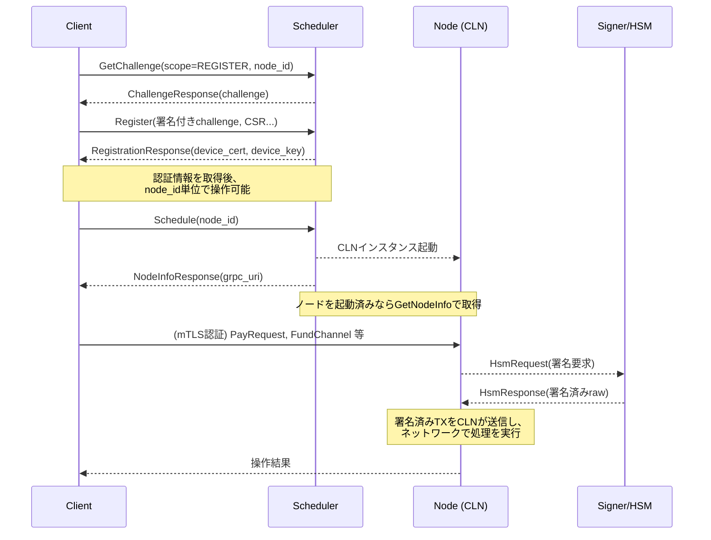
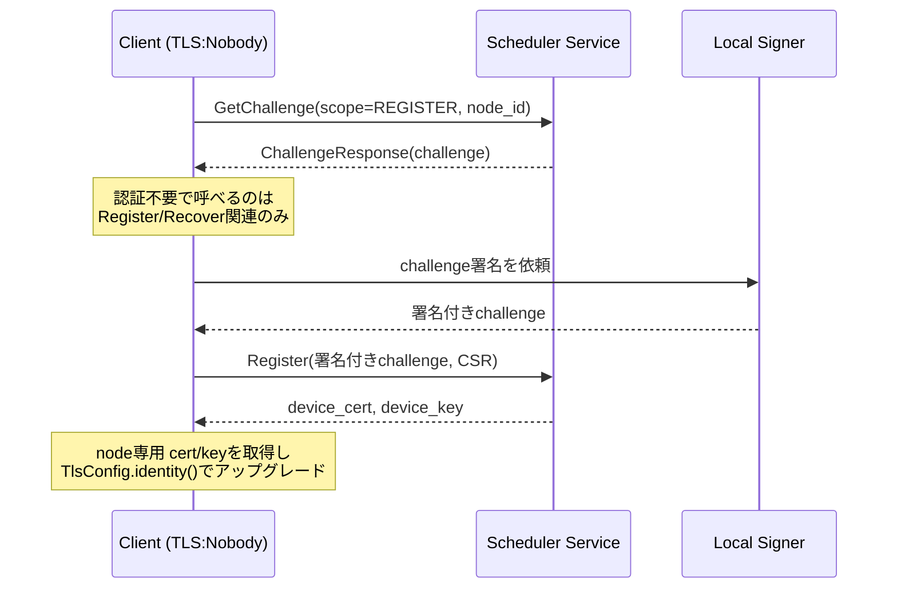
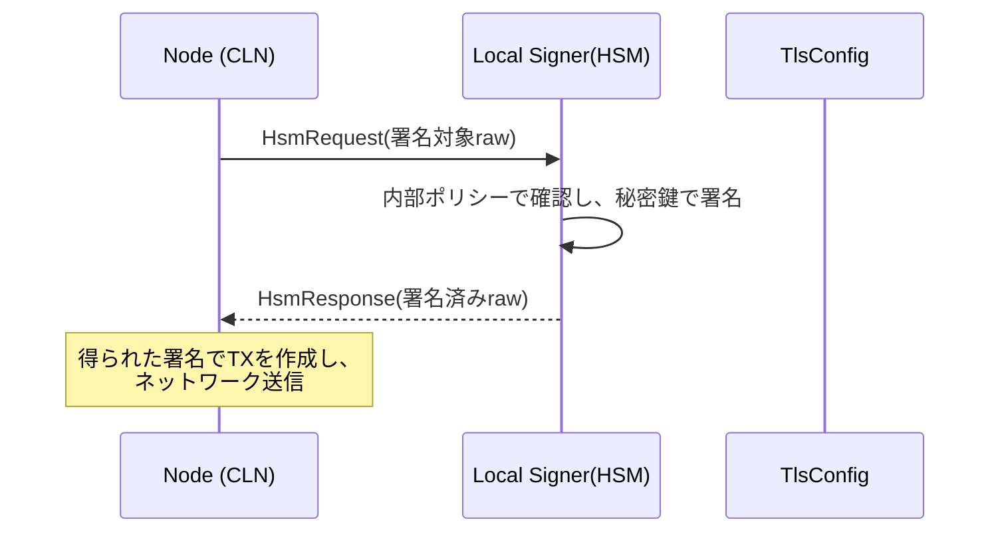
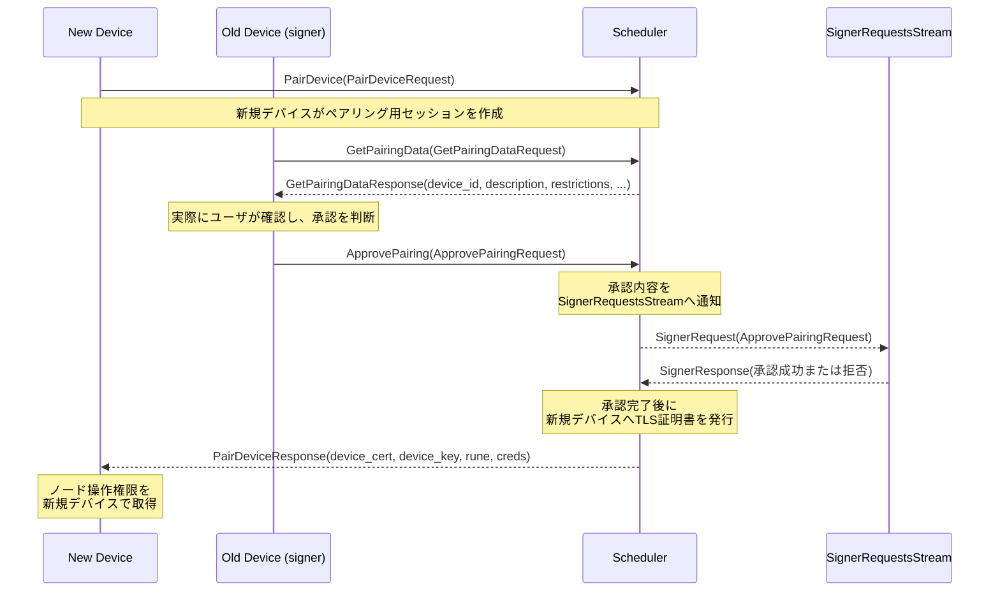

[greenlight proto](https://github.com/Blockstream/greenlight/tree/adac70212c70119cc7e7174a742133e14dcdea0a/libs/proto/glclient) をベースにした解説。

greenlightは、どこがself hostで、どこがtrust pointなのか把握しづらい。  
この記事では、SchedulerとSigner、clnの関係性を整理し、それぞれの役割を明確にする。  
簡単に言うと、Schedulerはclosed sourceであり、それ以外は公開されている。  
自身でclnのsignerのpluginを稼働させることはないが、おそらく、検証プロセスの透明化のため、また、test serverの起動のため公開されていると思われる。

```goat
(Self-Hosted)                                                    (Greenlight Hosted)

  +-----------------------------------+   (Manage API call)   +----------------------------+
  | UserClient (with integrated       | --------------------> | Scheduler (Closed Source)  |
  | Signer / HSM)                     |                       +-------------+--------------+
  +-----------------------------------+                                     |
                                     |                              (Node management)
                                     |                                      v
                                     |                           +------------------------+
                                     |----------------------->   |CLN (c-lightning+plugin)|
                                                                 +-----------+------------+
```

---

## ノード登録とスケジューリングフロー

### チャレンジ発行 (GetChallenge)
- scope (REGISTER or RECOVER) と node_id を渡し、サーバ側で challenge (署名対象) を生成  
- ChallengeResponse に一度きり有効な challenge が含まれ、後続の Register / Recover で署名送信に用いる  

### Register / Recover
- クライアントは challenge を秘密鍵で署名し、node_id, network, CSR などを付与して送信  
- サーバは署名検証によってノード所有権を確認し、mTLS 証明書 (device_cert, device_key) を発行  
- Register 時は初回発行、Recover 時は既存ノードの証明書再発行  
- 以降の操作は node_id ごとに厳密にアクセスを制限し、mTLS 認証により特定のクライアントだけが操作できる

### Schedule / GetNodeInfo
- Schedule でノード起動を要求すると、Greenlight インフラ上に c-lightning (CLN) が割り当てられ、grpc_uri 等の接続情報が返る  
- 既に起動済みであれば GetNodeInfo から接続情報を取得可能 (wait=true で割り当て完了を待機するシナリオもある)

### 接続・操作
- mTLS 認証情報 (device_cert, device_key) により node.proto や greenlight.proto 内の RPC (支払い・チャネル操作等) にアクセスできる  
- 署名操作が必要な場面 (例: チャネルオープン時のトランザクション署名など) では、SignerEngine (HSMRequest) を通じて秘密鍵署名を行う  

---

## Signer フロー (HSMRequest / HsmService)

`greenlight.proto` に定義される Node サービスには、HSM 関連の RPC が含まれている。以下のようなシナリオで署名リクエストをやり取りする:

1. ノード (CLN) 側が秘密鍵操作を要求  
   - StreamHsmRequests によって署名リクエスト (HsmRequest) が通知される  
2. Signer が応答生成  
   - ローカルデバイスの鍵管理アプリなどが HsmRequest を受け取り、秘密鍵署名や承認処理を実施  
3. Node へ署名結果を返却  
   - HsmResponse に署名済みバイト列 (raw) を格納し、RespondHsmRequest などから返却  
4. CLN は署名付きトランザクション等を用い、実際の処理を進める  

`greenlight.proto` の主な要素:  
- HsmRequest  
  - request_id: リクエストごとの識別子  
  - raw: 実際の署名対象となるバイト列  
  - signer_state: 鍵やポリシーなどサイナー側で保持する状態や認可情報  
- HsmResponse  
  - raw: 署名済みバイト列  
  - error: 不正リクエスト時のエラーメッセージ  

---

## CLN との連携

Scheduler.Service によってノード起動が要求されると、Greenlight インフラは内部で次の手順を踏む:

1. Scheduler がスケジューリング要求を受理  
2. 対応する c-lightning (CLN) インスタンスを確保し、ノード ID とネットワーク情報を紐づけ  
3. 起動または操作の過程で署名が必要な場合、CLN は Node サービスの StreamHsmRequests (HSMRequest) で外部サイナーへ署名リクエストを送る  
4. サイナーが HsmResponse で署名を返す  
5. CLN は署名付トランザクションを取得し、実際のチャネル操作などを実行  

---

## シーケンス図 (Mermaid)



---

## mTLS と HSM の詳細

### mTLS の目的と構造
- 通常のTLS とは異なり、サーバーとクライアントの双方が証明書を提示する双方向認証を実施  
- Greenlight では匿名用の“NOBODY”証明書から開始し、Register/Recover 成功後にノード専用のデバイス証明書を発行する  
- クライアントがノード秘密鍵を正当に所有していることを担保し、他ノードへの不正アクセスを防ぐ仕組み

#### mTLS シーケンス例 (Nobody → node特化証明書)


### HSM (Signer) の必要性
- on-chain 送金やチャネル開閉には秘密鍵署名が必須  
- セキュリティ上、秘密鍵を CLN 本体に渡さず、HSM (外部サイナー) が署名だけを担当  
- Greenlight の Signer 実装では、Scheduler 経由のチャレンジや起動時の認可ルールを踏まえ、秘密鍵を保持するサイナーが安全に署名を行う

#### HSM サインフロー: CLN→Signer


### greenlight/libs-gl-client のソース連携
- [tls.rs]  
  - CA, nobody証明書, device_cert などをロードして ClientTlsConfig を生成  
  - identity() メソッドで anonymous からノード固有証明書に切り替える  
- [scheduler.rs]  
  - Register() や Recover() を介して Scheduler.GetChallenge → 署名応答 → TLS証明書の発行という流れを実装  
  - ノード専用 TLS 証明書を受け取ったら TlsConfig.identity() で差し替える

---

## Pairing の詳細

### Pairingサービス (scheduler.proto)
pairing.proto (scheduler.proto 末尾) には次のメソッドが定義されている:

1. PairDevice(PairDeviceRequest) returns (PairDeviceResponse)  
   - 新規デバイスが device_id, CSR, デバイス名, restrictions などをサーバに送り、ペアリングセッションを作成  
   - サーバは一時的セッションを識別し、新規デバイスへのノードアクセス手続を下準備  
2. GetPairingData(GetPairingDataRequest) returns (GetPairingDataResponse)  
   - 既存デバイス (すでにノード署名権限を持つ) がセッション情報を取得し、新規デバイスを承認するか判断するためのデータを入手  
3. ApprovePairing(ApprovePairingRequest) returns (greenlight.Empty)  
   - 既存デバイスが最終承認し、サーバは新規デバイス向けに TLS 証明書などを最終発行  
   - Rune (制限情報) を付与し、SignerRequestsStream がポリシーチェックや署名承認を実行する場合もある

### 主要メッセージ (proto) 概要
- PairDeviceRequest:  
  - string device_id: 新規デバイスのパブリックキー  
  - bytes csr: CSR (証明書署名要求)  
  - string device_name: TLS証明書の CN 名の一部  
  - string description: 人手確認用メッセージ  
  - string restrictions: Rune など制約情報  
- PairDeviceResponse:  
  - device_cert, device_key, rune, creds などを返却し、新規デバイスがノードへアクセス可能になる  
- ApprovePairingRequest:  
  - string device_id: 新規デバイスのID  
  - uint64 timestamp: 承認時刻  
  - string device_name, string restrictions  
  - bytes sig: 既存デバイス (サイナー) による承認署名  
  - string rune: 承認に用いるRune  

### シーケンス図 (Mermaid) - Pairingフロー


### 流れのポイント
- 新規デバイスは PairDevice で CSR をアップロードし、サーバ側でセッションを確保  
- 既存デバイスが GetPairingData で情報を取り、ApprovePairing で最終承認  
- サイナー (既存デバイスの署名モジュール) が SignerRequestsStream で承認処理を行い、新規デバイスへ TLS cert/key と rune を発行  
- 新規デバイスはノードと同等 (または制限付き) の操作を取得し、秘密鍵を共有することなく権限移譲を実現する
