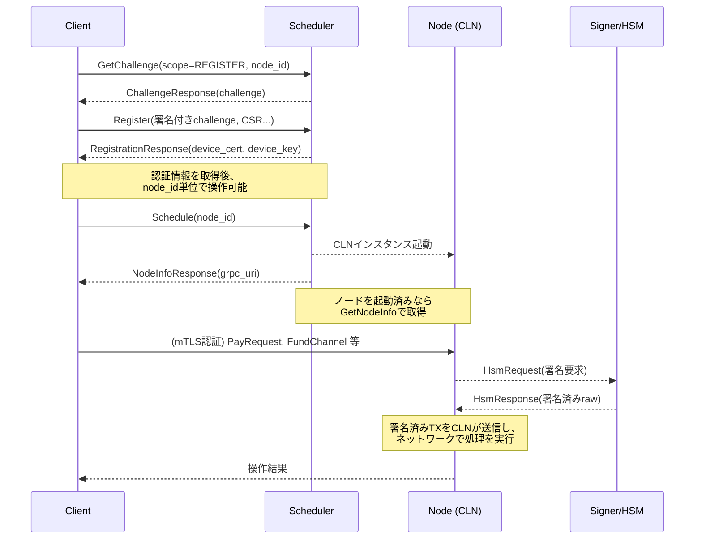
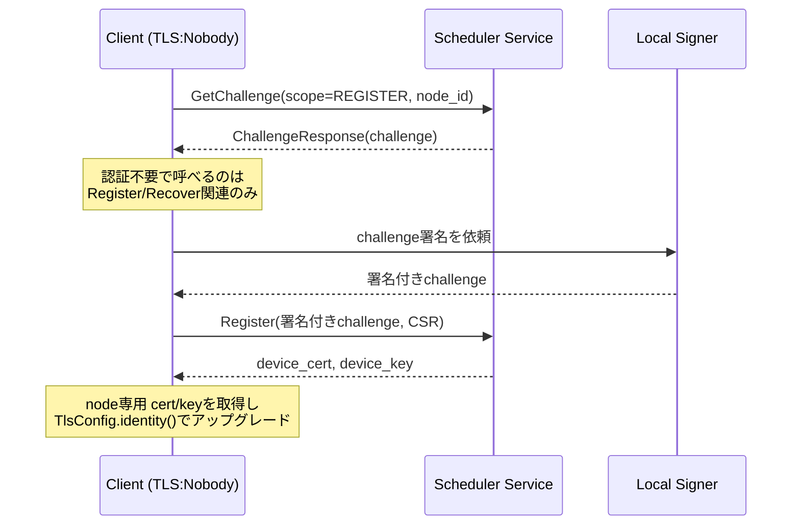
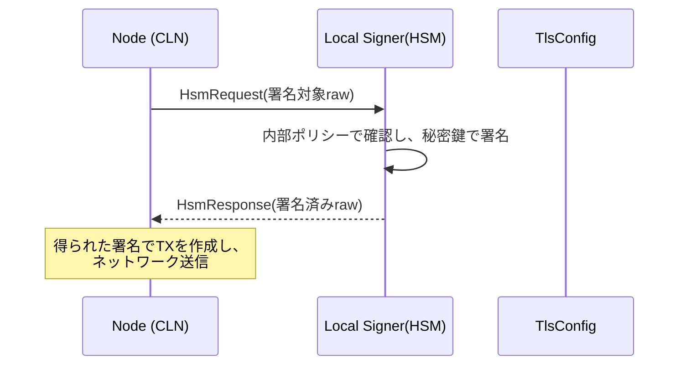
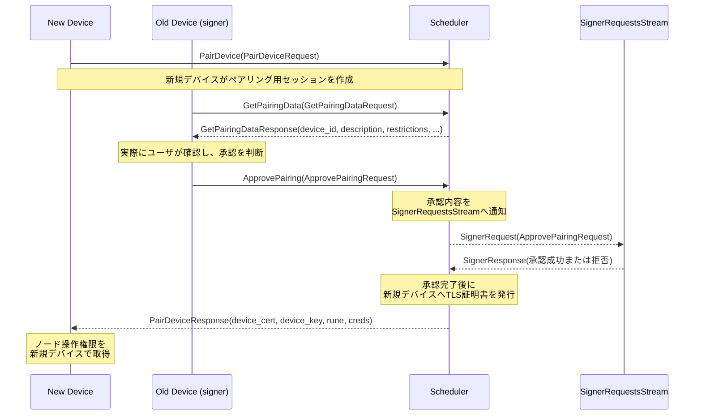

[greenlight proto](https://github.com/Blockstream/greenlight/tree/adac70212c70119cc7e7174a742133e14dcdea0a/libs/proto/glclient) をベースにした解説。

**目的と結論**  
Greenlight では、Scheduler (Closed Source) が Node 管理の中心にあり、UserClient (with integrated Signer/HSM) が Self-Hosted 環境で秘密鍵を保持する構造をとる。結論として、UserClient 側が鍵操作を制御しつつ、Greenlight 側の Scheduler が Node (CLN) を起動・管理する。これにより、秘密鍵をローカルで保持したまま Node をリモートで稼働させる運用が可能となる。

---

## 全体構造

以下の図に示すように、UserClient (with integrated Signer/HSM) は自前の環境 (Self-Hosted) で動作する。一方、Scheduler は Greenlight が管理し、CLN (c-lightning+plugin) も Greenlight Hosted 環境で稼働する。UserClient は Scheduler に対して Manage API call を行い、Node に対する操作は Scheduler が CLN を経由して実行する。Signer/HSM は秘密鍵をローカルで保持し、署名要求のみを受け付ける。

```
(Self-Hosted)                                                    (Greenlight Hosted)
  +-----------------------------------+   (Manage API call)   +----------------------------+
  | UserClient (with integrated       | --------------------> | Scheduler (Closed Source)  |
  | Signer / HSM)                     |                       +-------------+--------------+
  +-----------------------------------+                                     |
                                     |                              (Node management)
                                     |                                      v
                                     |                           +------------------------+
                                     |----------------------->   |CLN (c-lightning+plugin)|
                                                                 +-----------+------------+
```

---

## ノード登録とスケジューリングフロー
### チャレンジ発行 (GetChallenge)
1. スコープ (REGISTER や RECOVER) と node_id を指定し、Scheduler に GetChallenge をコールする。  
2. Scheduler は一度きり有効な challenge を生成し、ChallengeResponse に含めて返す。  

### Register / Recover
1. クライアントは challenge を秘密鍵で署名し、node_id、network、CSR などと共に送信する。  
2. Scheduler は署名検証後にノード所有権を確認し、mTLS のための device_cert と device_key を発行する。  
3. Register は新規発行、Recover は既存ノードの証明書再発行となる。  

### Schedule / GetNodeInfo
1. クライアントは Schedule を呼び出し、ノード起動をリクエストする。  
2. Scheduler は CLN を割り当て、grpc_uri など接続情報を返す。  
3. すでに起動済みの場合、GetNodeInfo で接続情報を取得可能である。  

### 接続・操作
1. クライアントは取得した device_cert と device_key を用い、mTLS で CLN (node) に接続する。  
2. 支払いやチャネル操作などの RPC 呼び出しを行う。  
3. 署名が必要な場合、CLN は Signer (HSM) へ HsmRequest を送信し、秘密鍵を外部に渡さずに署名のみを実行する。

---

## Signer フロー (HSMRequest / HsmService)
CLN は秘密鍵が必要なとき、Node Service の StreamHsmRequests を用いて外部サイナー (Signer/HSM) へ HsmRequest を通知する。Signer はローカルで署名を実施し、HsmResponse で返す。具体的な流れは以下の通りである。

1. **ノード (CLN) 側で署名が必要になる**  
2. **StreamHsmRequests によって署名リクエスト (HsmRequest) が Signer に飛ぶ**  
3. **Signer は秘密鍵で署名し、HsmResponse に署名データ (raw) を格納して返す**  
4. **CLN は署名済みトランザクションを使って on-chain 操作などを進行する**

---

## CLN との連携
Scheduler がスケジューリングリクエストを受けると、内部で以下を行う。

1. Scheduler が起動要求を受理する。  
2. 該当する CLN インスタンスを確保し、node_id とネットワーク情報を対応付ける。  
3. 署名が必要な場面で、CLN は Node サービスを通じてサイナーに HsmRequest を送る。  
4. サイナーが HsmResponse で署名済みバイト列を返す。  
5. CLN は得られた署名を使ってトランザクションを送信する。  

---

以下はノード登録と署名のやり取りを含むシーケンス図である。



---

## mTLS と HSM の詳細
### mTLS の目的と構造
mTLS (mutual TLS) は、Server・Client が互いに証明書を提示して正当性を認証し合う。Greenlight では初回アクセス時に “NOBODY” 証明書でレジストレーションを行い、Register/Recover 成功後にノード専用のデバイス証明書を取得する。この仕組みにより、誤ったクライアントが他人のノードを操作することを防げる。



### HSM (Signer) の必要性
on-chain での送金やチャネル開閉において、秘密鍵署名が必須となる。CLN が秘密鍵を直接保有しないため、Signer/HSM が外部署名を行う設計で鍵を安全に守る。Scheduler はノードの起動やポリシー管理を行い、Signer は鍵管理アプリとして署名のみ担当する。

#### HSM サインフロー: CLN→Signer


---

## Pairing の詳細
### Pairingサービス (scheduler.proto)
Pairing (ペアリング) は新規デバイスがノード操作権限を取得するプロセスである。既存デバイスの承認を経て、新規デバイスに TLS 証明書が発行される。

1. **PairDevice**: 新規デバイスは device_id, CSR, device_name, restrictions などを送信。  
2. **GetPairingData**: 既存デバイスが新規デバイスのペアリング情報を確認。  
3. **ApprovePairing**: 既存デバイスが最終承認し、サーバが新規デバイス向けに証明書を発行する。  



---

## まとめ
以上のとおり、UserClient (with integrated Signer/HSM) はセルフホストされ、ユーザが秘密鍵を常に制御する。一方、Scheduler (Closed Source) は Greenlight 側で稼働し、Node (CLN) の起動や管理を統括する。この構造により、秘密鍵保護とリモート運用を両立させつつ、ペアリング機能によってデバイス間で安全に権限を移管できる。