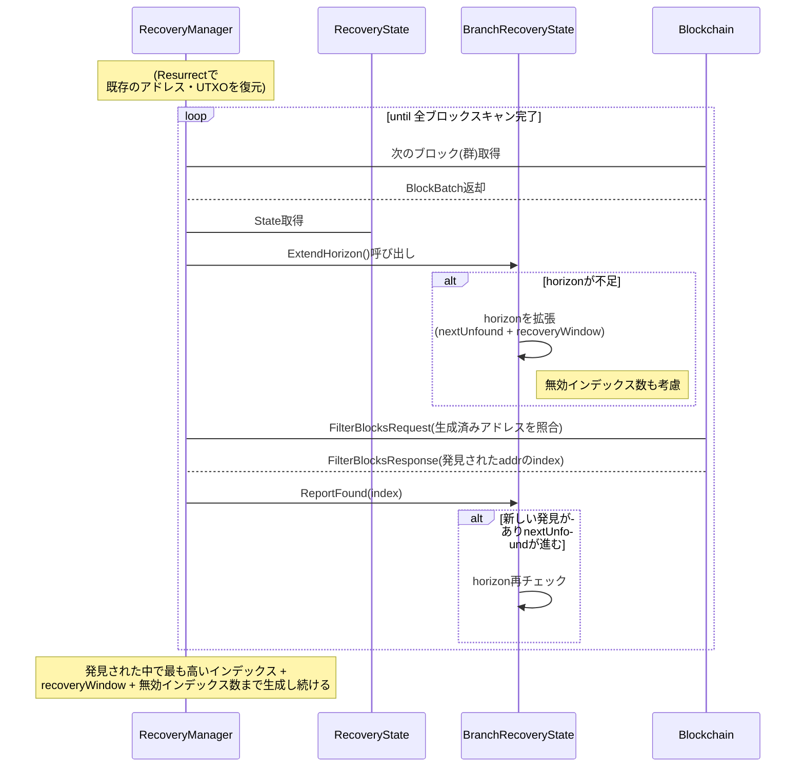

mnemonic seedを保持していれば、ウォレットの残高をリカバリーできる。これは一見不思議だが、実際には無限に生成可能なアドレス（script pubkey）のうち、使用されたものだけを検出し、UTXOを取得する仕組みがあるためである。どのアドレスが使われたかを追跡できるからこそ、seedを頼りに残高を復元できる。

しかし、mnemonic seedを持っているのに残高が正しく復旧しないケースも存在する。また、レガシーSegWit（P2SHアドレス・3xxxx）の潜在的な危険性は誤解を生みやすい。これらを整理するために、btc walletの実装（https://github.com/btcsuite/btcwallet）を例にしながら、BIP0044/49/84/86が規定するHDウォレット構造と、ウォレットのリカバリー方法を示す。

## BIPの概要と相互関係

BIP0044、BIP0049、BIP0084、BIP0086はいずれもHDウォレットの「目的（purpose）番号」を定義し、各アドレス形式を区別している。以下、それぞれの要点をまとめる。

### BIP44
- **概要**: `m/44'/coin_type'/account'/change/address_index` の構造を規定する汎用的HDウォレット標準。  
- **用途**: レガシーP2PKH（1xxxx）アドレスに広く利用されてきた。複数通貨・複数アカウント管理が可能。  
- **他BIPとの関係**: 新しいアドレス形式に対応するBIP49やBIP84などは、このBIP44をベースにpurpose番号を変えて並立利用できる。

### BIP49
- **概要**: `m/49'/coin_type'/account'/change/address_index` を使い、P2WPKH-in-P2SH（3xxxx）アドレスを定義。  
- **目的**: 互換性を重視しつつ部分的にSegWitの恩恵（手数料削減など）を得るためのラップドSegWit。  
- **他BIPとの関係**: レガシー形式（BIP44）を補完し、新しいネイティブSegWit（BIP84）へ移行する中継的役割を果たす。

### BIP84
- **概要**: `m/84'/coin_type'/account'/change/address_index` の構造を使い、ネイティブSegWit（bech32、bc1q...）アドレスを定義。  
- **目的**: SegWitの機能をフル活用し、より低い手数料やエラー検知の強化を実現。  
- **他BIPとの関係**: ラップドSegWit（BIP49）より進んだ純粋なSegWit。Taproot（BIP86）の前段階。

### BIP86
- **概要**: `m/86'/coin_type'/account'/change/address_index` を使い、Taproot（bech32m、bc1p...）アドレス（単独所有向け）を定義。  
- **目的**: Schnorr署名やMASTなどTaprootの恩恵（手数料削減・プライバシー向上）を得る。現時点ではシングルキー中心だが、将来的な拡張も想定。  
- **他BIPとの関係**: ネイティブSegWit（BIP84）より先進的なP2TR形態を扱う。purpose番号86を使い、既存形式と衝突しない。

## BIP49が「legacy segwit」と呼ばれる理由

BIP49のP2WPKH-in-P2SHアドレス（3xxxx）は見た目が通常のP2SHと同じため、一般に「legacy segwit」とも呼ばれる。P2SHの場合、redeemScriptをユーザ側で保持する必要があるが、BIP49対応ウォレット（例: 多くのハードウェアウォレットなど）を使うなら、redeemScriptを個別にバックアップしなくても済む。
https://github.com/btcsuite/btcwallet/blob/master/waddrmgr/address.go#L554

## アドレスインデックスとリカバリー

アドレスインデックス（`address_index`）はウォレットが生成したアドレス数に応じて変化する。復旧時には何番目までアドレスを生成してスキャンするかを決める必要がある。btc walletでは以下のアルゴリズムにより、使用中のアドレスを取りこぼさずに効率的なブロックスキャンを行う。

1. **Resurrect**  
   既知のアドレスやUTXOを `RecoveryState` に登録し、初期状態をセットする。  
2. **ExtendHorizon**  
   `nextUnfound + recoveryWindow (+ 無効インデックス数)` までアドレスを導出・監視対象に加えておき、取りこぼしを防ぐ。  
3. **FilterBlocks**  
   実際にブロックをスキャンし、高いインデックスのアドレスが見つかったら `ReportFound` で更新し、さらに `horizon` を見直す。  
4. **最終的に**  
   最も高いインデックス + recoveryWindow + 無効インデックス数まで検査し、使われている可能性のあるアドレスを漏れなく拾う。

### 注意
このアルゴリズムはbtc walletの実装に基づくものであり、他のウォレット実装には異なる部分があるかもしれない。  
また、recoveryWindowは、250が設定されている。  
一般的なユースケースでは考えづらいが、**250以上、indexが連続していない場合は、リカバリーが不完全になる可能性がある。**

---

mnemonic seedさえあれば複数のアドレス形式（P2PKH、P2WPKH-in-P2SH、P2WPKH、Taprootなど）をまとめて手堅くリカバリーできる。目的番号（purpose）を切り替えながら、ウォレットは無数に生成しうるアドレスのうち実使用されたものを判別して残高を復元する。

よって、各ウォレットで使われるHDウォレット構造（BIP44/49/84/86）を正しく守ることが重要である。これらのBIP（Bitcoin Improvement Proposal）は、アドレスを生成するための派生パスを詳細に規定している。これらの規定に従わずに作成された残高は通常の手順では検出できない。